# Causal Reasoning Pipeline — End-to-End Flow

One turn, start to finish. **Orange** = LLM call · **green** = deterministic (0 LLM) · **diamonds** = deterministic gates. This mirrors the diagram embedded in [causal_reasoning.md](causal_reasoning.md) (§2, "End-to-end execution flow"); the raw Mermaid source is in [causal_flow.mmd](causal_flow.mmd).

```mermaid
flowchart TD
    U(["User message"]) --> RT{"Contains<br/>&#91;&#91;causal:on&#93;&#93; ?"}
    RT -->|no| GA["general_assistant<br/>LLM + code executor"]
    GA --> OUT(["Response to user"])

    RT -->|yes| RST["CausalRouterAgent · 0 LLM<br/>reset causal_* · complexity → budgets<br/>store causal_query"]
    RST --> DEC["CausalDecomposer · LLM<br/>→ CausalDecomposition"]
    DEC --> BGP["build_graph_and_plan · 0 LLM<br/>DAG build / repair · critical path · plan"]
    BGP --> DECOK{"decomposition<br/>parseable?"}
    DECOK -->|yes| EG{"is_effect_query?"}
    EG -->|yes| ESP["CausalEstimandSpec · LLM<br/>→ CausalEstimand · variable-level DAG"]

    subgraph ESTG["CausalEstimator · 0 LLM · DoWhy"]
        direction TB
        IDN["identify_effect · data-free<br/>back-door / IV adjustment set"]
        IDN --> DATA{"dataset in<br/>message?"}
        DATA -->|no| WE1["write causal_estimand"]
        DATA -->|yes| EM["estimate_effect + refute<br/>random-common-cause · placebo"]
        EM --> WE2["write causal_estimand + causal_effect"]
    end

    subgraph LOOP["CausalExecutorLoop · LoopAgent · ≤16 iterations"]
        direction TB
        RDY{"next ready<br/>step?"}
        RDY -->|yes| EXE["CausalStepExecutor · LLM<br/>code execution + estimand grounding<br/>ends OBSERVED: / STEP_STATUS:"]
        EXE --> CTL["CausalStepController · 0 LLM<br/>parse verdict · ledger · graph"]
        CTL --> VD{"verdict?"}
        VD -->|success| DN{"plan done or<br/>budget spent?"}
        DN -->|more steps| RDY
        VD -->|failure / deviation| PROP["propagate_impact → invalidate<br/>affected subgraph"]
        PROP --> RPB{"replan<br/>budget?"}
        RPB -->|yes| RPL["CausalReplanner · LLM<br/>→ ReplanResult · affected only"]
        RPL --> SPL["splice_replan · 0 LLM<br/>insert steps · bump plan version"]
        SPL --> RDY
        RDY -->|none / deadlock| EXIT(["exit loop"])
        DN -->|done| EXIT
        RPB -->|no| EXIT
    end

    ESP --> IDN
    EG -->|no| RDY
    WE1 --> RDY
    WE2 --> RDY
    DECOK -->|no| SYN
    EXIT --> SYN["CausalSynthesizer · LLM<br/>final answer + estimand grounding<br/>→ causal_final_answer"]
    SYN --> FB["CausalFallbackEmitter · 0 LLM<br/>fenced causal-json · opt-in"]
    FB --> OUT

    IDN -. grounds .-> EXE
    IDN -. grounds .-> SYN

    classDef llm fill:#fde3c4,stroke:#e08a2e,color:#1a1a1a;
    classDef det fill:#d6ebd4,stroke:#4e9a4e,color:#1a1a1a;
    class GA,DEC,ESP,EXE,RPL,SYN llm;
    class RST,BGP,IDN,EM,WE1,WE2,CTL,PROP,SPL,FB det;
```

