# Causal Reasoning Pipeline

The causal-reasoning pipeline is TracerLensAi's core capability. When the UI's **Causal** toggle is on, the agent doesn't just answer — it builds a **causal graph** of the problem, **formally identifies** any treatment effect with DoWhy (and estimates it from data when a dataset is present), derives a **plan** along the critical path, **executes** it step-by-step with code, **propagates the impact** of any failure through the graph, **replans only the affected subgraph**, and finally **synthesizes** a grounded answer. Everything except the six LLM roles is deterministic Python.

This document is the deep-dive. For where the files live, see the [Repository Structure Guide](repository_structure.md); for the surrounding architecture, see the [Developer Guide](developer_guide.md).

---

## 1. Design Principles

1. **Determinism where it counts.** Routing, graph construction/repair, impact propagation, plan derivation, verdict parsing, replan splicing, and **statistical identification/estimation (DoWhy)** are pure Python (`networkx` + pydantic + `dowhy`). LLMs are used only for the six things they're good at: searching the web, decomposing, naming the estimand variables, executing a step, replanning a subgraph, and writing the final answer.
2. **Bounded cost.** The LLM budget per turn is `1 (decompose) + [≤1 (estimand spec — effect queries only)] + ≤max_steps (execute) + ≤max_replans (replan) + 1 (synthesize)`. The estimand-spec stage is skip-gated (§5), and DoWhy identification/estimation add **0** LLM calls. Budgets are sized per query by complexity and clamped by env ceilings. The loop has a hard structural ceiling (`LOOP_MAX_ITERATIONS=16`).
3. **Vertex tool isolation.** Vertex rejects mixing built-in tools (code execution) with function declarations, so **no `FunctionTool`s** are used. Each `LlmAgent` carries at most one of `{code_executor, output_schema, tools}`; all deterministic work lives in callbacks and custom `BaseAgent`s. This invariant is enforced by `tests/test_causal_agents.py`.
4. **One write, two purposes.** Every deterministic step writes to ADK session state via `actions.state_delta`. That single write is simultaneously the **persistence** record and the **UI transport** the proxy reads — no separate reporting channel.

---

## 2. Agent Tree

Built by `build_root_agent` / `build_causal_pipeline` in [`src/causal/agents.py`](../src/causal/agents.py):

```text
CausalRouterAgent  (custom, 0 LLM)         ── marker routing + state reset + budgets
├── general_assistant                       ── non-causal messages
└── CausalPipeline  (SequentialAgent)
    ├── CausalWebSearch   (LlmAgent, ≤1)    ── tools=[google_search]; skip-gated to [[web:on]]
    ├── CausalWebIngestor (custom, 0 LLM)   ── parse csv/evidence → causal_web_*
    ├── CausalDecomposer  (LlmAgent, 1)     ── output_schema=CausalDecomposition
    │     └─ after: build_graph_and_plan     ── DAG + plan (deterministic)
    ├── CausalEstimandSpec (LlmAgent, ≤1)   ── output_schema=CausalEstimand; skip-gated to effect queries
    ├── CausalEstimator   (custom, 0 LLM)   ── reconcile DAG (causal-learn, if data) → DoWhy identify (+ estimate/refute/counterfactual)
    ├── CausalExecutorLoop  (LoopAgent, ≤16)
    │     ├── CausalStepExecutor (LlmAgent) ── one step, BuiltInCodeExecutor
    │     ├── CausalStepController (custom) ── verdict, ledger, impact, replan-req
    │     └── CausalReplanner   (LlmAgent)  ── output_schema=ReplanResult (skipped on happy path)
    │           └─ after: splice_replan
    ├── CausalSynthesizer  (LlmAgent, 1)    ── output_key=causal_final_answer
    └── CausalFallbackEmitter (custom, 0)   ── fenced causal-json only if CAUSAL_TEXT_FALLBACK=1
```

| Agent | LLM calls | Responsibility |
|---|---|---|
| `CausalRouterAgent` | 0 | Routes by the `[[causal:on]]` marker; on a causal turn, resets stale `causal_*` state, seeds budgets, and records the `[[web:on]]` flag. |
| `CausalWebSearch` | ≤1 | On `[[web:on]]` only, a Search-only agent (`tools=[google_search]`) fetches best-effort observational data / evidence; skip-gated otherwise (§5.1). |
| `CausalWebIngestor` | 0 | Parses the search output into `causal_web_dataset` / `causal_web_evidence` (deterministic). |
| `CausalDecomposer` | 1 | Emits `CausalDecomposition` (components + directed causal edges) via constrained decoding. |
| `CausalEstimandSpec` | ≤1 | On effect queries only, emits a **variable-level** DAG + treatment/outcome (`CausalEstimand`); skip-gated otherwise (§5). |
| `CausalEstimator` | 0 | Deterministic: with data, corrects the DAG via causal-learn discovery, then DoWhy identification (always) + estimation/refutation and gcm counterfactuals. See §5 / §5.1. |
| `CausalStepExecutor` | 1/step | Executes exactly one plan step, using Python where it helps; ends with an `OBSERVED:`/`STEP_STATUS:` trailer. |
| `CausalStepController` | 0 | The deterministic heart — see §6. |
| `CausalReplanner` | ≤1/failure | Produces replacement steps **only** for the affected subgraph; skipped unless a replan was requested. |
| `CausalSynthesizer` | 1 | Writes the final user-facing answer grounded in the executed plan. |
| `CausalFallbackEmitter` | 0 | Optional text transport for proxies that can't read state deltas. |

### End-to-end execution flow

One turn, start to finish. **Orange** nodes are the (up to six) LLM calls; **green** nodes are deterministic Python (zero LLM); **diamonds** are deterministic gates. The happy path is the straight line down the middle — the branches are the skip-gates (web retrieval, effect-query), the DoWhy + causal-learn stage, and the failure/replan loop. Dotted edges show the identified estimand *grounding* the executor and synthesizer prompts.

```mermaid
flowchart TD
    U(["User message"]) --> RT{"Contains<br/>&#91;&#91;causal:on&#93;&#93; ?"}
    RT -->|no| GA["general_assistant<br/>LLM + code executor"]
    GA --> OUT(["Response to user"])

    RT -->|yes| RST["CausalRouterAgent · 0 LLM<br/>reset causal_* · complexity → budgets<br/>store causal_query · &#91;&#91;web:on&#93;&#93; flag"]
    RST --> WQ{"web toggle on?"}
    WQ -->|yes| WS["CausalWebSearch · LLM · google_search<br/>fetch csv data / evidence"]
    WS --> WIN["CausalWebIngestor · 0 LLM<br/>parse → causal_web_dataset / evidence"]
    WQ -->|no| DEC
    WIN --> DEC["CausalDecomposer · LLM<br/>→ CausalDecomposition"]
    DEC --> BGP["build_graph_and_plan · 0 LLM<br/>DAG build / repair · critical path · plan"]
    BGP --> DECOK{"decomposition<br/>parseable?"}
    DECOK -->|yes| EG{"is_effect_query?"}
    EG -->|yes| ESP["CausalEstimandSpec · LLM<br/>→ CausalEstimand · variable-level DAG"]

    subgraph ESTG["CausalEstimator · 0 LLM · DoWhy + causal-learn"]
        direction TB
        ACQ{"dataset available?<br/>(attached or web)"}
        ACQ -->|no| IDN["identify_effect · data-free<br/>back-door / IV adjustment set"]
        ACQ -->|yes| RCN["reconcile_graph · causal-learn<br/>PC + LiNGAM · correct the DAG<br/>write causal_graph_reconcile"]
        RCN --> IDN
        IDN --> DATA{"dataset<br/>present?"}
        DATA -->|no| WE1["write causal_estimand"]
        DATA -->|yes| EM["estimate_effect + refute<br/>(+ gcm counterfactual if asked)"]
        EM --> WE2["write causal_estimand + causal_effect<br/>(+ causal_counterfactual)"]
    end

    subgraph LOOP["CausalExecutorLoop · LoopAgent · ≤16 iterations"]
        direction TB
        RDY{"next ready<br/>step?"}
        RDY -->|yes| EXE["CausalStepExecutor · LLM<br/>code execution + estimand grounding<br/>ends OBSERVED: / STEP_STATUS:"]
        EXE --> CTL["CausalStepController · 0 LLM<br/>parse verdict · ledger · graph"]
        CTL --> VD{"verdict?"}
        VD -->|success| DN{"plan done or<br/>budget spent?"}
        DN -->|more steps| RDY
        VD -->|failure / deviation| PROP["propagate_impact → invalidate<br/>affected subgraph"]
        PROP --> RPB{"replan<br/>budget?"}
        RPB -->|yes| RPL["CausalReplanner · LLM<br/>→ ReplanResult · affected only"]
        RPL --> SPL["splice_replan · 0 LLM<br/>insert steps · bump plan version"]
        SPL --> RDY
        RDY -->|none / deadlock| EXIT(["exit loop"])
        DN -->|done| EXIT
        RPB -->|no| EXIT
    end

    ESP --> ACQ
    EG -->|no| RDY
    WE1 --> RDY
    WE2 --> RDY
    DECOK -->|no| SYN
    EXIT --> SYN["CausalSynthesizer · LLM<br/>final answer + estimand grounding<br/>→ causal_final_answer"]
    SYN --> FB["CausalFallbackEmitter · 0 LLM<br/>fenced causal-json · opt-in"]
    FB --> OUT

    IDN -. grounds .-> EXE
    IDN -. grounds .-> SYN

    classDef llm fill:#fde3c4,stroke:#e08a2e,color:#1a1a1a;
    classDef det fill:#d6ebd4,stroke:#4e9a4e,color:#1a1a1a;
    class GA,DEC,ESP,EXE,RPL,SYN,WS llm;
    class RST,BGP,IDN,EM,WE1,WE2,CTL,PROP,SPL,FB,WIN,RCN det;
```



Reading it: the LLM calls (orange) are `[web-search] → decompose → estimand-spec → execute-step → replan → synthesize`; everything else — routing, graph build/repair, web ingest, causal-learn DAG correction, DoWhy identification & estimation, verdict/impact/replan bookkeeping, transport — is deterministic. The skip-gates (`web toggle`, `is_effect_query`, `next ready step?`) and the replanner's own guard keep the common path cheap.

---

## 3. Routing & Budgets

[`src/causal/router.py`](../src/causal/router.py) decides the pathway with zero LLM calls: an LLM router would need auto-injected transfer declarations (which Vertex won't mix with code execution) and cost a call per turn. Marker matching is free.

On a causal turn the router:
1. Resets every `causal_*` key (`ALL_KEYS`) to clear stale state from a prior turn in the session.
2. Computes a **complexity tier** and a **budget** from the query text.
3. Seeds `causal_budgets`, an initial `causal_steps` trace line, an empty ledger, and `CausalStatus(phase="decomposing")`.

Complexity scoring ([`src/causal/complexity.py`](../src/causal/complexity.py)) is deterministic and cheap — it sizes the reasoning budget *before* spending any tokens:

| Tier | max_steps | max_replans |
|---|---|---|
| simple | 3 | 1 |
| moderate | 5 | 1 |
| complex | 8 | 2 |
| very_complex | 12 | 2 |

The score comes from lexical signals: length buckets, causal/analytical vocabulary, comparison/scenario framing, multiple question marks, and clause density. Attached-file blocks are stripped before scoring so a large pasted file doesn't inflate complexity. The per-query budget is then **clamped** by the `CAUSAL_MAX_STEPS` / `CAUSAL_MAX_REPLANS` env ceilings (defaults 8 / 2).

---

## 4. The Graph Engine

[`src/causal/graph_engine.py`](../src/causal/graph_engine.py) — `CausalTaskGraph`, a validated DAG plus pure operations on it (no I/O, no LLM).

### Build & repair
`from_decomposition` turns the LLM's `CausalDecomposition` into a valid DAG, repairing deterministically (never a second LLM call):
- de-duplicate components and edges, drop self-loops and dangling edges;
- cap components at `MAX_COMPONENTS` (12, keeping outcomes + ancestors first) and edges at `MAX_EDGES` (24, keeping the highest-confidence);
- break cycles by removing the lowest-confidence edge of each cycle until the graph is acyclic.

All repairs are recorded in `repair_notes` and surfaced as `[graph] repair: …` trace lines.

### Critical path & plan
`critical_path` is the confidence-weighted longest path into the outcome nodes (the "global optimum pathway"). `derive_plan` produces one `PlanStep` per **actionable** component (`process`/`artifact`/`outcome`) in topological order; step dependencies mirror causal in-edges. If the plan exceeds `max_steps`, truncation keeps the critical path first.

### Impact propagation & replanning
- `propagate_impact(component_id)` → the descendants a change affects (`nx.descendants`).
- `invalidate(plan, affected)` marks steps on affected components `invalidated`; completed work on **unaffected** components is left intact, keeping replans localized.
- `subgraph_slice(...)` extracts just the affected components/edges to feed the replanner (never the whole graph).
- `splice(plan, replan, request)` inserts replacement steps (rejecting out-of-scope ones deterministically) and bumps the plan version.

---

## 5. Formal Identification & Estimation (DoWhy)

Structural graph reasoning (the component DAG in §4) is not statistical causal inference. For **treatment-effect** questions the pipeline adds a deterministic DoWhy stage so *identification* — deciding which variables to adjust for — is a graph algorithm, not the LLM's guess (LLMs quietly over-adjust for mediators/colliders, biasing the estimand).

Two agents, inserted between the decomposer and the executor loop:

- **`CausalEstimandSpec`** — a schema-only `LlmAgent` that emits a **variable-level** DAG (`CausalEstimand`: variables with roles + directed edges + which is treatment/outcome, plus optional counterfactual anchor values). This is a different abstraction from the decomposer's *task* graph, so it gets its own shallow schema. A before-callback (`skip_unless_effect_query`) returns `_SKIP` unless the query is an effect-estimation ask — detected by the lexical `complexity.is_effect_query` **OR-ed with the decomposer's semantic `is_effect_query` flag** (the decomposer is already a structured call, so paraphrases the regex misses still get the formal path at zero extra cost). When a dataset is attached, its column headers are pinned into the prompt (`estimation.dataset_headers`) so the LLM's variable ids line up with the columns estimation will need.
- **`CausalEstimator`** ([`estimator.py`](../src/causal/estimator.py)) — a deterministic `BaseAgent` (0 LLM) that runs [`estimation.run_identification`](../src/causal/estimation.py):
  - **Identification (always, data-free):** builds a DoWhy `CausalModel` from the variable DAG and calls `identify_effect` → the back-door adjustment set / instruments, the estimand type, and whether the effect is identifiable at all. This needs no dataset because identification is purely symbolic — which is why it fits a project whose queries usually carry no data. Variables declared in the graph but absent from the data are treated by DoWhy as **unobserved** confounders, correctly forcing IV (or honest non-identifiability) instead of a biased back-door estimate.
  - **Estimation + refutation (only with data):** if a CSV/TSV was attached (`parse_dataset` extracts it from the `--- Attached file ---` block the proxy injects), it runs `estimate_effect` — the method matched to the identified estimand (back-door linear regression / `iv.instrumental_variable` / `frontdoor.two_stage_regression`) — plus two refuters (`random_common_cause`, `placebo_treatment_refuter`). Refutation verdicts use the refuter's own **significance test (p > 0.05 ⇒ survived)** when DoWhy provides one; a 15% tolerance is only the fallback.
  - **Counterfactuals (rung 3, data + counterfactual phrasing only):** for "what would Y have been had T…" queries (`complexity.is_counterfactual_query`), `estimation.run_counterfactual` fits a full SCM with `dowhy.gcm` and compares average outcomes under `do(T=baseline)` vs `do(T=intervention)` — anchor values come from the query when named, else the treatment's 25th/75th percentiles.

All results ride one `state_delta` (`causal_estimand` / `causal_effect` / `causal_counterfactual`; one write, two purposes). The identified estimand — and the counterfactual contrast when computed — is injected into the executor and synthesizer prompts (`prompts._estimand_grounding`), so the LLM's numeric answer is anchored to the formal adjustment set instead of ad-hoc confounders — identification moves *out* of the LLM, the same "determinism where it counts" principle as the rest of the engine.

**Never fatal:** any DoWhy or dataset problem degrades to a noted, not-identifiable `IdentificationResult` (counterfactuals simply don't emit); the pipeline keeps running and the LLM still answers. Requires `dowhy>=0.12` (0.11.x is incompatible with `networkx>=3.3`).

### 5.1 Web-sourced data & data-driven DAG correction

Two related additions close the engine's remaining gaps — "mostly no dataset" and "the LLM's DAG is never data-checked":

- **Web retrieval (the data source).** The `Add observation data from the web` UI toggle sends `web_search`; the proxy injects a `[[web:on]]` marker (mirroring `[[causal:on]]`) which the router turns into `causal_web_requested`. A **Search-only `LlmAgent`** (`CausalWebSearch`, carrying **only** `tools=[google_search]` — no code executor/schema, so tool isolation holds) runs first, skip-gated on the flag, and emits marker-delimited text (a fenced ` ```csv ` block or `EVIDENCE:`/`SOURCES:` lines). The deterministic `CausalWebIngestor` (0 LLM) parses it (`estimation.parse_web_retrieval`) into `causal_web_dataset` / `causal_web_evidence`. The estimator then acquires its dataframe via `estimation.acquire_dataframe` — an attached CSV first, else the web CSV — so estimation, refutation, counterfactuals, and the correction below all light up on web-sourced data. Evidence is injected into the estimand-spec and synthesizer prompts to reduce omitted confounders.
- **Data-driven DAG correction (causal discovery).** When a dataframe is available, `CausalEstimator` runs [`discovery.reconcile_graph`](../src/causal/discovery.py) *before* identification. It targets the **variable-level** DAG (the only graph whose nodes are data columns), runs constraint-based discovery (**causal-learn** PC, FisherZ) for the skeleton and **DirectLiNGAM** for edge direction, and **conservatively** reconciles them against the LLM prior: the LLM edge is kept unless the data disagrees *strongly and directionally* (a reversal needs PC to be non-contradicting **and** LiNGAM to orient the other way; a missing-but-measured confounder is *added*; a suspected latent confounder is *flagged*, never invented). Every edit is logged as a `GraphChange`; the corrected edge set is what DoWhy then identifies/estimates on, so a reversed edge or omitted confounder changes the *answer*, not just an annotation. The single pass also yields the `consistent` / `corrected` / `untestable` verdict for free (the skeleton's independence tests are the same signal a standalone falsification check would give), and a `corrected` verdict prepends a prominent caution to the grounding. **Never fatal / never blocks:** no data, `causal-learn` absent, or any error → the DAG is used exactly as asserted. Requires `causal-learn>=0.1.3` (agent image only; imported lazily, a soft dependency).

---

## 6. The Execution Loop

The `LoopAgent` runs three sub-agents per iteration: **executor → controller → replanner**. The controller ([`src/causal/controller.py`](../src/causal/controller.py)) is where the determinism lives — it runs after the executor on every iteration and yields exactly one event whose `state_delta` is both the persistence write and the UI transport.

Each iteration:
1. **Read the verdict.** `parse_step_verdict` ([`runtime.py`](../src/causal/runtime.py)) parses the executor's `OBSERVED:` / `STEP_STATUS:` trailer. A missing trailer is a `deviation`; a failed code-execution outcome downgrades a claimed `success` to a `deviation`.
2. **On success** — mark the step/component done, append a `[ok]` trace line, then either advance to the next ready step, stop if the step budget is spent, or move to `synthesizing` if the plan is complete.
3. **On failure/deviation** — mark the step/component failed, `propagate_impact` to descendants, `invalidate` the affected steps, and if replan budget remains, build a `ReplanRequest` for the affected subgraph (→ the replanner runs next iteration); otherwise escalate with `budget_exhausted`.
4. **Record** a `ChangeRecord` in the append-only, capped [ledger](../src/causal/ledger.py) and write the updated plan, graph (full + UI shape), trace, and status.

Guard callbacks ([`src/causal/callbacks.py`](../src/causal/callbacks.py)) keep the happy path cheap: `skip_if_no_ready_step` prevents an LLM call when there's nothing to execute, and `skip_unless_replan_requested` means replanning costs **0** LLM calls unless a failure actually requested it. `skip_if_aborted` short-circuits the whole loop when decomposition failed.

If decomposition is unparseable, the pipeline degrades gracefully: it sets `phase="failed"` with a note, and the synthesizer answers the question directly without the graph.

---

## 7. State-Key Contract & Transport

All pipeline state lives under `causal_*` session keys ([`src/causal/state_keys.py`](../src/causal/state_keys.py)):

| Key | Contents | Read by the proxy? |
|---|---|---|
| `causal_graph` | UI-shaped `{nodes, edges, critical_path, version}` | ✅ → `causal_graph` |
| `causal_steps` | `list[str]` human-readable trace lines | ✅ → `causal_reasoning_steps` |
| `causal_status` | `CausalStatus` (phase + counters) | ✅ → `causal_status` |
| `causal_final_answer` | synthesizer's answer | ✅ → `response` |
| `causal_graph_full` | full `CausalGraph` for rehydration | internal |
| `causal_estimand` | `IdentificationResult` (adjustment set, estimand type, identifiability) | ✅ → `causal_estimand` |
| `causal_effect` | `EffectEstimate` (point, CI, refutations + p-values) or null | ✅ → `causal_effect` |
| `causal_counterfactual` | `CounterfactualResult` (do-contrast outcomes + delta) or null | ✅ → `causal_counterfactual` |
| `causal_graph_reconcile` | `GraphReconciliation` (verdict, edits, latent confounders) or null | ✅ → `causal_graph_reconcile` |
| `causal_web_retrieval` | `WebRetrieval` (mode dataset/evidence/none, row count, sources) or null | ✅ → `causal_web_retrieval` |
| `causal_plan` | `ExecutionPlan` — backs the step counter and `PlanView` | ✅ → `causal_plan` |
| `causal_ledger` | `list[ChangeRecord]` — backs the click-through drawer | ✅ → `causal_ledger` |
| `causal_ledger_dropped` | count of entries lost past `LEDGER_CAP`, so the drawer stays honest | ✅ → `causal_ledger_dropped` |
| `causal_replan_events` | why the plan changed | ✅ → `causal_replan_events` |
| `causal_run_id` | correlation id from the `[[run:<id>]]` marker | internal (observability) |
| `causal_current_step`, `causal_budgets`, `causal_estimand_spec_raw`, `causal_web_requested`, `causal_web_dataset`, `causal_web_search_raw`, … | pipeline internals | internal |

The proxy collects every `causal_*` key it sees in each event's `actions.state_delta` and forwards the UI-facing fields. Three things are shared between the two backends and nothing else: the **markers** (`[[causal:on]]`, `[[web:on]]`, `[[run:<id>]]`), the **`causal_` prefix**, and the **agent names** in the proxy's `STAGE_BY_AUTHOR` map. The proxy does not ship `src/`.

**Streaming.** State deltas do not reach the browser as one payload at the end. The proxy converts them into Server-Sent Events as the run proceeds — `progress` frames carrying the stage and any new trace lines, `graph` frames when the DAG changes, and a final `done` frame with the whole report. The contract is specified in the [Developer Guide](developer_guide.md#the-sse-contract).

**Transport fallback.** If a proxy can't read state deltas, running the agent with `CAUSAL_TEXT_FALLBACK=1` makes `CausalFallbackEmitter` emit the results as a fenced ` ```causal-json ` block; the proxy's `_extract_causal_fallback` parses it and strips it from the visible answer. This path is silent (zero LLM calls) by default.

---

## 8. Rendering in the UI

The right-hand pane is React, under [`ui/src/components/causal/`](../ui/src/components/causal/). [`CausalPanel.tsx`](../ui/src/components/causal/CausalPanel.tsx) is the container — a phase badge, the identification card, the step trace (tagged `[ok]`/`[FAIL]`/etc.), the graph, the plan, and the drawer. It is **lazily loaded**: it pulls ReactFlow and dagre, which have no business in the chunk that blocks first paint.

| Component | Renders |
|---|---|
| [`CausalGraph.tsx`](../ui/src/components/causal/CausalGraph.tsx) | The DAG, via **ReactFlow** with a **dagre** layout. Node status maps to colours (pending/active/done/failed/affected); critical-path edges are thickened; low-confidence edges render soft. |
| [`EstimandCard.tsx`](../ui/src/components/causal/EstimandCard.tsx) | Estimand-type chip (backdoor/iv/frontdoor, amber when not identifiable), `treatment → outcome`, adjustment-set pills, the graph-fix badge (green *data-consistent* / amber *graph corrected (N)* / grey *untestable*) and the web badge. |
| [`EffectChart.tsx`](../ui/src/components/causal/EffectChart.tsx) | Effect ± CI, method, n, and pass/fail refutation rows with p-values. |
| [`PlanView.tsx`](../ui/src/components/causal/PlanView.tsx) | The execution plan and per-step status. |
| [`WorkflowTimeline.tsx`](../ui/src/components/causal/WorkflowTimeline.tsx) | Live stage progress with elapsed timers. |
| [`StepDrawer.tsx`](../ui/src/components/causal/StepDrawer.tsx) | Click-through ledger detail for a step or node. |

Node ids and labels come from the LLM and are treated as untrusted throughout. React escapes text by default, and the one place raw HTML is produced — the Markdown answer — goes through **DOMPurify** in [`ui/src/lib/markdown.ts`](../ui/src/lib/markdown.ts). That module also linkifies `[Node: <label>]` citations in the answer into buttons that highlight the matching DAG node; the transform walks text nodes over the already-sanitized DOM and builds elements with `createElement`, so nothing is spliced back in as markup.

**Layout is memoised on a topology fingerprint**, not on the graph object — a status frame arrives for every node transition and would otherwise re-run dagre and make the graph jump. Edges use a separate key that includes confidence and the critical path, since those change an edge's appearance without changing the topology.

In the proxy's mock mode (no `AGENT_ENGINE_ENDPOINT`), a canned 3-node graph, step trace, identification card, graph-fix reconciliation, and (with the web toggle) a web-dataset payload are returned so the entire causal UI is developable offline.

---

## 9. Environment Variables

| Variable | Default | Effect |
|---|---|---|
| `CAUSAL_MAX_STEPS` | 8 | Ceiling on executed plan steps per turn (clamps the dynamic budget). |
| `CAUSAL_MAX_REPLANS` | 2 | Ceiling on localized replans per turn. |
| `CAUSAL_TEXT_FALLBACK` | off | When `1`, also emit results as a fenced `causal-json` block. |

Structural constants (not env-overridable) live in `state_keys.py`: `MAX_COMPONENTS=12`, `MAX_EDGES=24`, `LOOP_MAX_ITERATIONS=16`, `LEDGER_CAP=50`.

---

## 10. Tests

| File | Covers |
|---|---|
| `tests/test_causal_agents.py` | Agent-tree wiring and the built-in-tool isolation invariant. |
| `tests/test_causal_estimation.py` | DoWhy identification correctness (confounder/mediator/collider), effect recovery + refutation, gcm counterfactuals, dataset/header parsing, web-output parsing (`parse_web_retrieval`) + `acquire_dataframe`, and the effect/counterfactual query gates. |
| `tests/test_causal_discovery.py` | Data-driven DAG correction: the money test (a correct DAG is left untouched; a reversed edge / omitted confounder is corrected so identification recovers the right adjustment set), untestable/no-data guards, never-raises. `importorskip("causallearn")`. |
| `tests/test_causal_benchmark.py` | Ground-truth benchmark: synthetic SCMs with known ATEs (confounders, mediator/collider traps, irrelevant covariate, unobserved confounder → IV) across seeds. |
| `tests/test_causal_complexity.py` | Complexity scoring → budget tiers. |
| `tests/test_causal_engine.py` | Graph build/repair, critical path, plan derivation, impact, splice. |
| `tests/test_causal_runtime.py` | Verdict parsing and decision helpers. |
| `tests/test_causal_pipeline_flow.py` | End-to-end flow over the engine. |
| `tests/test_main_causal.py` | Proxy transport: causal + web marker prepend, `state_delta` collection (incl. `causal_graph_reconcile` / `causal_web_retrieval`), fenced-block fallback, mock graph/web. |

The pure modules (`state_keys`, `models`, `complexity`, `graph_engine`, `runtime`, `ledger`, `estimation`, `discovery`) have no ADK/Vertex imports, so these tests run fast and hermetically. `estimation` and `discovery` lazily import `dowhy`/`pandas`/`causallearn` inside their functions, so importing them stays cheap; the DoWhy and discovery correctness tests `importorskip("dowhy")` / `importorskip("causallearn")` and are the only ones that need the heavy dependencies.

**LLM-in-the-loop tier.** `tests/eval/datasets/causal-inference-dataset.json` runs the same ground truths *end-to-end through the deployed pipeline* (marker included in the prompts): back-door identification with and without data, the mediator/collider traps, and a counterfactual — graded by the LLM judge in `tests/eval/metrics.py`, whose `causal_correctness` axis is weighted highest. Run with `agents-cli eval generate --dataset tests/eval/datasets/causal-inference-dataset.json` then `agents-cli eval grade`.
